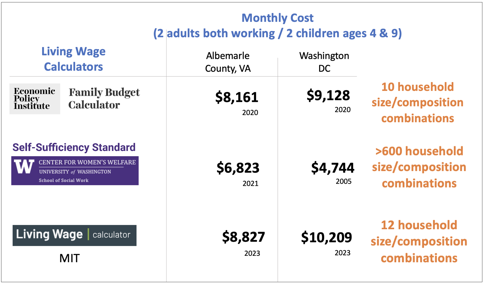

 
 

## Cost-of-Living (COL) Definition 

The COL is the income a family needs to function in society at a modest yet adequate standard of living in the community in which they reside. The COL is a function of household size and composition and where the household is located. The components that allow for a modest standard of living include the cost of housing, food, healthcare, childcare, transportation, internet, and other necessities such as clothing, household supplies, personal care, nonprescription medicine, and school supplies, along with a household’s tax liability. 

It assumes the full cost of each need, without government subsidies (e.g., public housing, Medicaid, or childcare assistance); or nonprofit or informal assistance from family and friends (e.g., unpaid childcare by a relative, food from food banks, or shared housing). 

 
 

## Other Estimations

There are several tools to help individuals, communities, and employers determine a local wage rate that allows residents to meet minimum standards of living. These costs-of-living are used to backout the area minimum wage. However, they are not have updated estimates and do not consider the household composition of the geographies.  For example, these are three living wage calculators or monthly costs for tow adults and two children:
 

  

