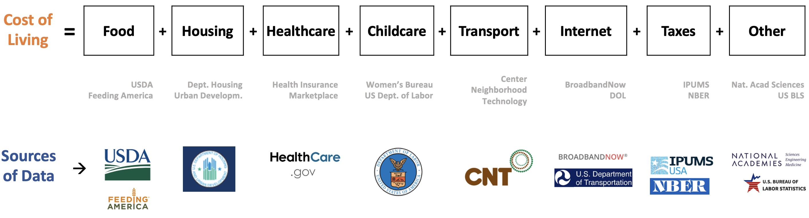

 
 

## COL Data Discovery Results

 
The COL estimates includes seven categories of expenditure that help meet the basic necessities of households without public or private assistance.  These categories were identified from the major components of anual expenses, identified in the Consumer Expenditure Survey. The following figure summarizes the categories and their corresponding sources of information. 

 
 

  

 
 

The COL estimates use multiple sources of publicly available information.  In the next table, we include the data sources, geographical area, geography adjustments, inflationadjustments, and assumptions that were used for the seven components of the COL. 

 
 

### Components of the Cost-of-Living:Date, Data Source, Geographic Area, and Adjustments

<table class="tg">
<thead>
  <tr>
    <th class="tg-cttg">Component    </th>
    <th class="tg-cttg">Data  Updates    </th>
    <th class="tg-cttg">Data Source</th>
    <th class="tg-cttg">Original  Geographic  Area</th>
    <th class="tg-cttg">Geographic Area Adjustment</th>
    <th class="tg-cttg">Inflation (Time) Adjustment</th>
    <th class="tg-cttg">Final Geographic  Area</th>
  </tr>
</thead>
<tbody>
  <tr>
    <td class="tg-fymr">&nbsp;&nbsp;&nbsp; Housing&nbsp;&nbsp;&nbsp;</td>
    <td class="tg-0pky">&nbsp;&nbsp;&nbsp; Yearly&nbsp;&nbsp;&nbsp;</td>
    <td class="tg-0pky">&nbsp;&nbsp;&nbsp; HUD&nbsp;&nbsp;&nbsp;Small Area 40% of <a href="https://www.huduser.gov/portal/datasets/fmr/smallarea/index.html">Fair&nbsp;&nbsp;&nbsp;Market Rent</a>&nbsp;&nbsp;&nbsp;&nbsp;</td>
    <td class="tg-0pky">&nbsp;&nbsp;&nbsp; ZIP&nbsp;&nbsp;&nbsp;code &nbsp;&nbsp;&nbsp;  &nbsp;&nbsp;&nbsp;</td>
    <td class="tg-0pky">&nbsp;&nbsp;&nbsp; ZIPS&nbsp;&nbsp;&nbsp;codes are distributed to census tracts based on demographic data&nbsp;&nbsp;&nbsp;</td>
    <td class="tg-0pky">&nbsp;&nbsp;&nbsp; NA&nbsp;&nbsp;&nbsp;</td>
    <td class="tg-0pky">&nbsp;&nbsp;&nbsp; Census&nbsp;&nbsp;&nbsp; &nbsp;&nbsp;&nbsp; tract&nbsp;&nbsp;&nbsp;</td>
  </tr>
  <tr>
    <td class="tg-fymr">&nbsp;&nbsp;&nbsp; Food&nbsp;&nbsp;&nbsp;</td>
    <td class="tg-0pky">&nbsp;&nbsp;&nbsp; Monthly&nbsp;&nbsp;&nbsp;</td>
    <td class="tg-0pky">&nbsp;&nbsp;&nbsp; <a href="https://www.fns.usda.gov/cnpp/usda-food-plans-cost-food-reports-monthly-reports">USDA&nbsp;&nbsp;&nbsp;Food Plans: Cost of Food Reports (monthly reports)</a> &nbsp;&nbsp;&nbsp; Low,&nbsp;&nbsp;&nbsp;Moderate, and Liberal Food Plans&nbsp;&nbsp;&nbsp;</td>
    <td class="tg-0pky">&nbsp;&nbsp;&nbsp; National&nbsp;&nbsp;&nbsp;&nbsp;&nbsp;&nbsp;</td>
    <td class="tg-0pky">&nbsp;&nbsp;&nbsp; National&nbsp;&nbsp;&nbsp;adjusted to the county level using 2020 Feeding America’s Map the Meal Gap&nbsp;&nbsp;&nbsp;estimates at the county and independent city level&nbsp;&nbsp;&nbsp;</td>
    <td class="tg-0pky">&nbsp;&nbsp;&nbsp; <a href="https://www.bls.gov/regions/mid-atlantic/news-release/consumerpriceindex_washingtondc.htm#ro3xg01wbu.f.1">Consumer&nbsp;&nbsp;&nbsp;Price Index, Washington-Arlington-Alexandria area – November 2022</a>; &nbsp;&nbsp;&nbsp; <a href="https://www.bls.gov/regions/mid-atlantic/news-release/2021/consumerpriceindex_washingtondc_20211210.htm">Consumer&nbsp;&nbsp;&nbsp;Price Index, Washington-Arlington-Alexandria area – November 2021</a> &nbsp;&nbsp;&nbsp; (used&nbsp;&nbsp;&nbsp;to adjust the 2020 Feeding America’s Map the Meal Gap data)&nbsp;&nbsp;&nbsp;</td>
    <td class="tg-0pky">&nbsp;&nbsp;&nbsp; County&nbsp;&nbsp;&nbsp;</td>
  </tr>
  <tr>
    <td class="tg-fymr">&nbsp;&nbsp;&nbsp; Transportation&nbsp;&nbsp;&nbsp;</td>
    <td class="tg-0pky">&nbsp;&nbsp;&nbsp; Yearly&nbsp;&nbsp;&nbsp;</td>
    <td class="tg-0pky">&nbsp;&nbsp;&nbsp; <a href="https://htaindex.cnt.org/">H+T</a>&nbsp;&nbsp;&nbsp;(Housing + Transit Affordability Index)  &nbsp;&nbsp;&nbsp; non-profit&nbsp;&nbsp;&nbsp;<a href="https://cnt.org/">Center for Neighborhood&nbsp;&nbsp;&nbsp;Technology</a> &nbsp;&nbsp;&nbsp; (<a href="https://htaindex.cnt.org/about/method-2022.pdf">Methodology</a>)&nbsp;&nbsp;&nbsp;</td>
    <td class="tg-0pky">&nbsp;&nbsp;&nbsp; Census&nbsp;&nbsp;&nbsp;tract&nbsp;&nbsp;&nbsp;</td>
    <td class="tg-0pky">&nbsp;&nbsp;&nbsp; NA&nbsp;&nbsp;&nbsp;</td>
    <td class="tg-0pky">&nbsp;&nbsp;&nbsp; NA&nbsp;&nbsp;&nbsp;</td>
    <td class="tg-0pky">&nbsp;&nbsp;&nbsp; Census&nbsp;&nbsp;&nbsp; &nbsp;&nbsp;&nbsp; tract&nbsp;&nbsp;&nbsp;</td>
  </tr>
  <tr>
    <td class="tg-fymr">&nbsp;&nbsp;&nbsp; Healthcare&nbsp;&nbsp;&nbsp;</td>
    <td class="tg-0pky">&nbsp;&nbsp;&nbsp; Yearly&nbsp;&nbsp;&nbsp;</td>
    <td class="tg-0pky">&nbsp;&nbsp;&nbsp; U.S. Centers for&nbsp;&nbsp;&nbsp;Medicare &amp; Medicaid Services, &nbsp;&nbsp;&nbsp; <a href="https://www.healthcare.gov/apply-and-enroll/how-to-apply/">Health Insurance Market Place</a> &nbsp;&nbsp;&nbsp;</td>
    <td class="tg-0pky">&nbsp;&nbsp;&nbsp; ZIP&nbsp;&nbsp;&nbsp;code &nbsp;&nbsp;&nbsp;  &nbsp;&nbsp;&nbsp;</td>
    <td class="tg-0pky">&nbsp;&nbsp;&nbsp; NA&nbsp;&nbsp;&nbsp;</td>
    <td class="tg-0pky">&nbsp;&nbsp;&nbsp; NA&nbsp;&nbsp;&nbsp;</td>
    <td class="tg-0pky">&nbsp;&nbsp;&nbsp; County&nbsp;&nbsp;&nbsp;</td>
  </tr>
  <tr>
    <td class="tg-fymr">&nbsp;&nbsp;&nbsp; Childcare&nbsp;&nbsp;&nbsp;</td>
    <td class="tg-0pky">&nbsp;&nbsp;&nbsp; Biennial&nbsp;&nbsp;&nbsp;</td>
    <td class="tg-0pky">&nbsp;&nbsp;&nbsp; <a href="https://www.dol.gov/agencies/wb/topics/featured-childcare">Department&nbsp;&nbsp;&nbsp;of Labor Women’s Bureau National</a> Database of Median Childcare&nbsp;&nbsp;&nbsp;Prices  &nbsp;&nbsp;&nbsp; (<a href="https://www.dol.gov/sites/dolgov/files/WB/media/NationalDatabaseofChildcarePricesTechnicalGuideFinal.pdf">Methodology</a>)&nbsp;&nbsp;&nbsp;</td>
    <td class="tg-0pky">&nbsp;&nbsp;&nbsp; County&nbsp;&nbsp;&nbsp;</td>
    <td class="tg-0pky">&nbsp;&nbsp;&nbsp; NA&nbsp;&nbsp;&nbsp;</td>
    <td class="tg-0pky">&nbsp;&nbsp;&nbsp; Department&nbsp;&nbsp;&nbsp;of Labor Women’s Bureau National Methodology used to impute the Washington,&nbsp;&nbsp;&nbsp;D.C. child care area cost from 2012 to 2022&nbsp;&nbsp;&nbsp;</td>
    <td class="tg-0pky">&nbsp;&nbsp;&nbsp; County&nbsp;&nbsp;&nbsp;</td>
  </tr>
  <tr>
    <td class="tg-fymr">&nbsp;&nbsp;&nbsp; Broadband&nbsp;&nbsp;&nbsp;</td>
    <td class="tg-0pky">&nbsp;&nbsp;&nbsp; NA&nbsp;&nbsp;&nbsp;</td>
    <td class="tg-0pky">&nbsp;&nbsp;&nbsp; Scraped&nbsp;&nbsp;&nbsp;from <a href="https://broadbandnow.com/">BroadbandNow</a> &nbsp;&nbsp;&nbsp; Median&nbsp;&nbsp;&nbsp;of the lowest prices for 100 Mbps download plans for&nbsp;&nbsp;&nbsp;addresses from the &nbsp;&nbsp;&nbsp; <a href="https://www.transportation.gov/gis/national-address-database">Department&nbsp;&nbsp;&nbsp;of Transportation, National Address Database</a>&nbsp;&nbsp;&nbsp;</td>
    <td class="tg-0pky">&nbsp;&nbsp;&nbsp; Address&nbsp;&nbsp;&nbsp;at the center of a Census block&nbsp;&nbsp;&nbsp;&nbsp;</td>
    <td class="tg-0pky">&nbsp;&nbsp;&nbsp; NA&nbsp;&nbsp;&nbsp;</td>
    <td class="tg-0pky">&nbsp;&nbsp;&nbsp; NA&nbsp;&nbsp;&nbsp;</td>
    <td class="tg-0pky">&nbsp;&nbsp;&nbsp; Census&nbsp;&nbsp;&nbsp;tract&nbsp;&nbsp;&nbsp;</td>
  </tr>
  <tr>
    <td class="tg-fymr">&nbsp;&nbsp;&nbsp; Other&nbsp;&nbsp;&nbsp;Necessities&nbsp;&nbsp;&nbsp;</td>
    <td class="tg-0pky">&nbsp;&nbsp;&nbsp; NA&nbsp;&nbsp;&nbsp;</td>
    <td class="tg-0pky">    National Academy of Sciences, An Updated Measure of Poverty: (Re)Drawing the Line (2023) Report. (20%)</td>
    <td class="tg-0pky">&nbsp;&nbsp;&nbsp; NA&nbsp;&nbsp;&nbsp;</td>
    <td class="tg-0pky">&nbsp;&nbsp;&nbsp; NA&nbsp;&nbsp;&nbsp;</td>
    <td class="tg-0pky">&nbsp;&nbsp;&nbsp; NA&nbsp;&nbsp;&nbsp;</td>
    <td class="tg-0pky">&nbsp;&nbsp;&nbsp; NA&nbsp;&nbsp;&nbsp;</td>
  </tr>
  <tr>
    <td class="tg-fymr">&nbsp;&nbsp;&nbsp; Taxes&nbsp;&nbsp;&nbsp;</td>
    <td class="tg-0pky">&nbsp;&nbsp;&nbsp; Yearly&nbsp;&nbsp;&nbsp;</td>
    <td class="tg-0pky">&nbsp;&nbsp;&nbsp; National&nbsp;&nbsp;&nbsp;Bureau of Economic Research’s program <a href="http://taxsim.nber.org/taxsim35/">TAXSIM</a> Version&nbsp;&nbsp;&nbsp;35 which has an interface in R <a href="https://cran.rstudio.com/web/packages/usincometaxes/vignettes/using-usincometaxes.html">usincometaxes</a>&nbsp;&nbsp;&nbsp;</td>
    <td class="tg-0pky">&nbsp;&nbsp;&nbsp; State&nbsp;&nbsp;&nbsp;</td>
    <td class="tg-0pky">&nbsp;&nbsp;&nbsp; NA&nbsp;&nbsp;&nbsp;</td>
    <td class="tg-0pky">&nbsp;&nbsp;&nbsp; NA&nbsp;&nbsp;&nbsp;</td>
    <td class="tg-0pky">&nbsp;&nbsp;&nbsp; State&nbsp;&nbsp;&nbsp;</td>
  </tr>
</tbody>
</table>

 
 

## Assumptions

<table class="tg">
<thead>
  <tr>
    <th class="tg-pewz">     Component    </th>
    <th class="tg-pewz">     Price by Category Combinations    </th>
    <th class="tg-pewz">     Assumptions    </th>
  </tr>
</thead>
<tbody>
  <tr>
    <td class="tg-amwm">Housing</td>
    <td class="tg-0lax">·   Yearly ·   Apartment sizes: studio, 1, 2, 3, and 4 bedrooms</td>
    <td class="tg-0lax">·   1-person in a studio ·   2-people in a 1 bedroom ·   3-people in a 2 bedroom ·   4-people or more in a 3 bedroom</td>
  </tr>
  <tr>
    <td class="tg-amwm">Food</td>
    <td class="tg-0lax">·   Monthly ·   Four food plans: low, moderate, and liberal ·   Gender: female and male ·   Age: Child 1, 1-3, 4-5, 6-8, 9-11; Female 12-13, 14-18, 19-50, 51-70, 71+; Male 12-13, 14-18, 19-50, 51-70, 71+   </td>
    <td class="tg-0lax">·  half of the people in a household are female and half are male ·  infants &lt; 1 year ·  toddlers 1-3 years ·  preschoolers 4-5 years ·  schoolers 6-11 years ·  teenagers 12-18 years ·  adults older than 19 years</td>
  </tr>
  <tr>
    <td class="tg-amwm">Transportation</td>
    <td class="tg-0lax">·   Yearly  </td>
    <td class="tg-0lax">·  includes auto ownership, auto use, and transit use ·  independent of family size and composition</td>
  </tr>
  <tr>
    <td class="tg-amwm">Healthcare</td>
    <td class="tg-0lax">·   Yearly ·   Household size ·   Household composition ·   Age ·   Income</td>
    <td class="tg-0lax">Households purchase health insurance through the Affordable Care Act Market Place.</td>
  </tr>
  <tr>
    <td class="tg-amwm">Childcare</td>
    <td class="tg-0lax">·   Biennial ·   Type: center and home-base ·   Age: infant, toddler, preschool, schoolers</td>
    <td class="tg-0lax">·  parents use home-based care children ·  &gt;12 (teenagers) do not require childcare ·  infants &lt; 1 ·  toddlers 1-3 ·  preschoolers 4-5 ·  schoolers 6-18</td>
  </tr>
  <tr>
    <td class="tg-amwm">Broadband</td>
    <td class="tg-0lax">·   Yearly  </td>
    <td class="tg-0lax">·  median of the lowest price for 100 Mbps download speed</td>
  </tr>
  <tr>
    <td class="tg-amwm">Other Necessities</td>
    <td class="tg-0lax">·   Yearly  </td>
    <td class="tg-0lax">·  20% of a household's expenditure on Housing and Food.</td>
  </tr>
  <tr>
    <td class="tg-amwm">Taxes</td>
    <td class="tg-0lax">·   Yearly ·   Household size ·   Household composition ·   Age of children ·   Income</td>
    <td class="tg-0lax">·  all households are renters therefore pay no property taxes ·  tax liability includes income and sales taxes at the federal and state levels ·  there are no household deductions</td>
  </tr>
</tbody>
</table>

